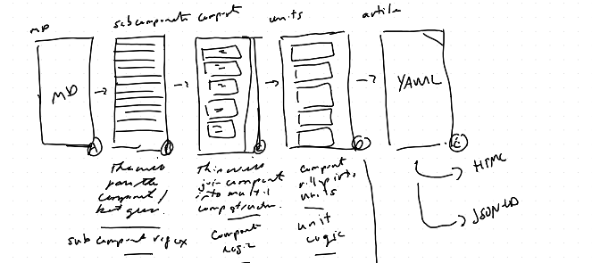

# Markdown to YAML to JSON-LD Hack

**A working prototype created as part of an AI-driven Product Management Hackathon (April 1–3, 2025).**

## 📝 Overview

This project provides a robust workflow to convert Markdown documents into structured JSON-LD data, using YAML as an intermediate, author-friendly format. This approach facilitates structured content creation, validation, and transformation into semantic JSON-LD and HTML outputs.

The prototype was developed using AI-driven workflows to rapidly iterate and validate features.



## 🚀 Project Goals

- **Markdown** ➜ **Structured YAML** ➜ **JSON-LD & HTML**
- Provide author-friendly YAML to simplify structured content authoring.
- Validate content structures rigorously using JSON Schema.
- Generate semantically rich JSON-LD compliant with Schema.org's Article schema.
- Automate HTML page generation from JSON-LD.

## 📂 Project Structure

```text
.
├── conversions
├── converters
│   ├── json-ld-to-html.py
│   ├── yaml_to_jsonld.py
│   └── template.html
├── definitions
├── docs
│   └── design-docs
├── md-to-yaml-cli
│   ├── config
│   ├── logs
│   ├── schemas
│   ├── src
│   ├── templates
│   ├── tests
│   └── code-readme.md
├── README.md
└── requirements.txt
```

## 🛠 How It Works

### Step 1: Markdown to YAML
- CLI (`md-to-yaml-cli`) parses Markdown files into structured YAML.
- YAML is validated against JSON Schema for content correctness.

### Step 2: YAML to JSON-LD
- YAML content is converted into JSON-LD format (`converters/yaml_to_jsonld.py`).
- JSON-LD follows Schema.org Article structure, enabling semantic clarity.

### Step 3: JSON-LD to HTML
- JSON-LD data is transformed into HTML (`converters/json-ld-to-html.py`) using templates (`template.html`).

## ⚙️ Setup and Usage

### Install dependencies

```bash
pip install -r requirements.txt
```

### Run Conversion

**Markdown to YAML:**

```bash
python md-to-yaml-cli/src/main.py --input example.md
```

**YAML to JSON-LD:**

```bash
python converters/yaml_to_jsonld.py example.yml output.jsonld
```

**JSON-LD to HTML:**

```bash
python converters/json-ld-to-html.py output.jsonld final.html
```

## 🧪 Running Tests

Run all unit tests easily:

```bash
pytest
```

## 📅 Hackathon Background

**Date:** April 1–3, 2025  
**Purpose:** To leverage AI-driven workflows to rapidly prototype a structured content workflow from Markdown through YAML into JSON-LD, resulting in a clear, semantic, and easily maintainable content pipeline.

## 📜 License (MIT)

MIT License © 2025  
Permission is hereby granted, free of charge, to any person obtaining a copy of this software and associated documentation files (the "Software"), to deal in the Software without restriction, including without limitation the rights to use, copy, modify, merge, publish, distribute, sublicense, and/or sell copies of the Software, and to permit persons to whom the Software is furnished to do so, subject to the following conditions:

The above copyright notice and this permission notice shall be included in all copies or substantial portions of the Software.

THE SOFTWARE IS PROVIDED "AS IS", WITHOUT WARRANTY OF ANY KIND, EXPRESS OR IMPLIED, INCLUDING BUT NOT LIMITED TO THE WARRANTIES OF MERCHANTABILITY, FITNESS FOR A PARTICULAR PURPOSE, AND NONINFRINGEMENT. IN NO EVENT SHALL THE AUTHORS OR COPYRIGHT HOLDERS BE LIABLE FOR ANY CLAIM, DAMAGES, OR OTHER LIABILITY, WHETHER IN AN ACTION OF CONTRACT, TORT, OR OTHERWISE, ARISING FROM, OUT OF OR IN CONNECTION WITH THE SOFTWARE OR THE USE OR OTHER DEALINGS IN THE SOFTWARE.

